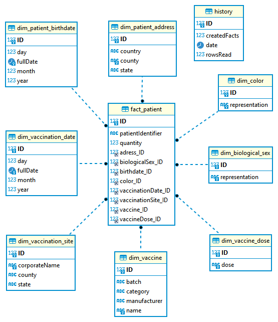

# ETL for COVID-19 vaccination data
ETL for Covid-19 vaccination data extraction. Produced as an evaluation of the Decision Support Systems course in college.

The data supported by the application are from [Ministério da Saúde](http://www.saude.gov.br/), about vaccination against Covid-19 in Brazil.

## Intructions
- View "data" folder and follow instructions;
- Create a MySQL database named "covid-vaccination-etl";
- Change connection properties of "persistence.xml";
- Run code and type data filename.

## Entity relationship diagram

